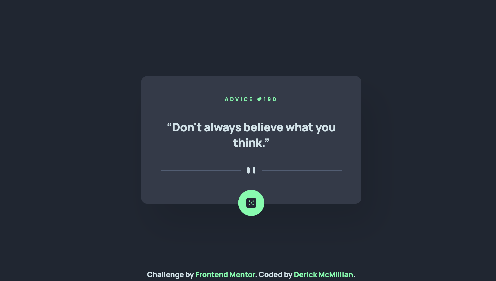

# Frontend Mentor - Advice generator app solution

This is a solution to the [Advice generator app challenge on Frontend Mentor](https://www.frontendmentor.io/challenges/advice-generator-app-QdUG-13db).
Frontend Mentor challenges help you improve your coding skills by building realistic projects.

## Table of contents

- [Overview](#overview)
  - [The challenge](#the-challenge)
  - [Screenshot](#screenshot)
  - [Links](#links)
- [My process](#my-process)
  - [Built with](#built-with)
  - [What I learned](#what-i-learned)
- [Author](#author)

## Overview

### The challenge

Users should be able to:

- View the optimal layout for the app depending on their device's screen size
- See hover states for all interactive elements on the page
- Generate a new piece of advice by clicking the dice icon

### Screenshot

### Links

- Solution URL: [https://github.com/derick4L/advice-generator-app](https://github.com/derick4L/advice-generator-app)
- Live Site URL: [https://advice-generator-derickm.netlify.app/](https://advice-generator-derickm.netlify.app/)

## My process

### Built with

- Semantic HTML5 markup
- CSS custom properties
- Web Components
- Flexbox
- CSS Grid
- Mobile-first workflow

### What I learned

I learned how to use Web Components to leverage HTML, CSS, and JavaScript while building on my knowledge of component based architecture. By using Web Components, I built several class methods utilizing the 'this' keyword, and even made Fetch API call. My understanding of scope, templates, components and the DOM are highlighted here.

## Author

- Website - [Derick McMillian](https://thederickmcmillian.com)
- Frontend Mentor - [@derick4L](https://www.frontendmentor.io/profile/derick4L)

**Note: Delete this note and add/remove/edit lines above based on what links you'd like to share.**
